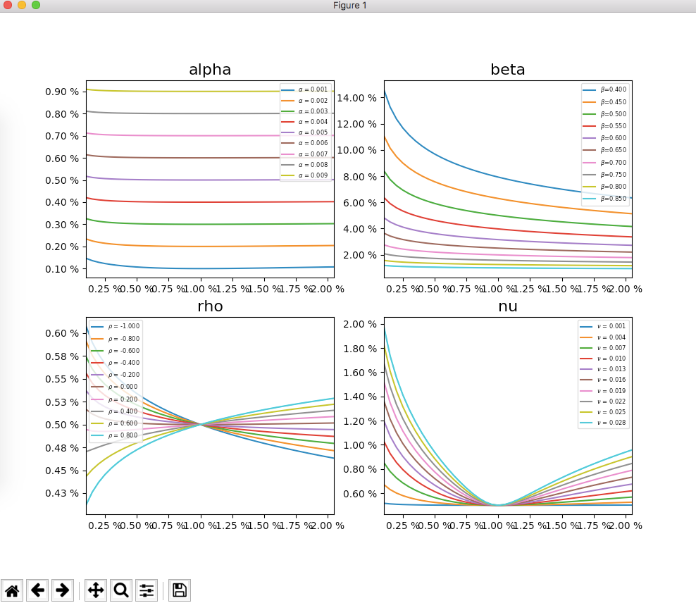

.. image:: https://travis-ci.org/i05nagai/mafipy.svg?branch=master
   :target: https://travis-ci.org/i05nagai/mafipy

.. image:: https://circleci.com/gh/i05nagai/mafipy.svg?style=svg
    :target: https://circleci.com/gh/i05nagai/mafipy

.. image:: https://codeclimate.com/github/i05nagai/mafipy/badges/gpa.svg
   :target: https://codeclimate.com/github/i05nagai/mafipy
   :alt: Code Climate

.. image:: https://codeclimate.com/github/i05nagai/mafipy/badges/coverage.svg
   :target: https://codeclimate.com/github/i05nagai/mafipy/coverage
   :alt: Test Coverage

.. image:: https://codeclimate.com/github/i05nagai/mafipy/badges/issue_count.svg
   :target: https://codeclimate.com/github/i05nagai/mafipy
   :alt: Issue Count

.. image:: https://badges.gitter.im/mafipy/Lobby.svg
   :alt: Join the chat at https://gitter.im/mafipy/Lobby
   :target: https://gitter.im/mafipy/Lobby?utm_source=badge&utm_medium=badge&utm_campaign=pr-badge&utm_content=badge

mafipy
======

Description
============

mathmatical finance in python.
Supported methods are belows:

* replication method

  * QuantoCMS

* Analytic formula

  * Black Scholes

  * Black

  * SABR

* Quasi Monte Carlo

  * sobol sequence (cython) up to 21202 dimension

Installation
============

.. code:: shell

   pip install mafipy

Run examples

.. code:: shell

   git clone https://github.com/i05nagai/mafipy.git
   cd mafipy
   python examples/plot_smile_curve_sabr.py

You will see the following drawing.

Documentation
=============
* `API document`_ 

  .. _API document: https://i05nagai.github.io/mafipy_docs/html/

* `Benchmarks`_

  .. _`Benchmarks`: https://i05nagai.github.io/mafipy_benchmarks/html/

Contributing
============
Set up development environment.

.. code:: shell

   git clone https://github.com/i05nagai/mafipy.git
   cd mafipy
   git submodule init
   git submodule update
   pip install -r requirements.txt

Builds
------

To generate c files,

.. code:: shell

   python setup.py build_ext

Test
-----

To run tests, you additionally need to install `pytest`.

.. code:: shell

   pip install -r requirements-dev.txt
   python setup.py test

Benchmarks
----------

`asv` is required to execute benchmarks.
You can install `asv` by `pip`.

.. code:: shell

   pip install asv

Then 

.. code:: shell

   # execute benchmarks
   python setup.py benchmark
   # generate html file from the results
   python setup.py benchmark_publish
   # preview the generated html through local server
   python setup.py benchmark_preview

Release
--------
Suppose that we create the version `v.X.Y.Z`.
We follow `PEP0440`_ compatible versioning rule.

.. _`PEP0440`: https://www.python.org/dev/peps/pep-0440/

In Circle CI, every built creates release files in `master` brnach.
Make sure that the release files are properly created before releasing.

1. Create git tag locally

.. code-block:: shell

    git tag -a vX.Y.Z master
    # for testing purpose, in this case, the package will be uploaded to test.pypi.org
    git tag -a vX.Y.Zdev master

2. Push git tag to remote

.. code-block:: shell

    git push origin vX.Y.Z

3. Circle CI build and run tests. After all tests passed, Circle CI make a release to GitHub and upload wheels to PyPI.

Related Projects
================
* `GitHub - lballabio/QuantLib: The QuantLib C++ library <https://github.com/lballabio/QuantLib>`_

  * One of the best library for mathmatical finance.
    The library is written in C++. 
    There are many wrapper projects of the QuantLib.
* `GitHub - finmath/finmath-lib: Mathematical Finance Library: Algorithms and methodologies related to mathematical finance. <https://github.com/finmath/finmath-lib>`_

  * Mathematical Finance Library: Algorithms and methodologies related to mathematical finance.
    The library is written in Java.
